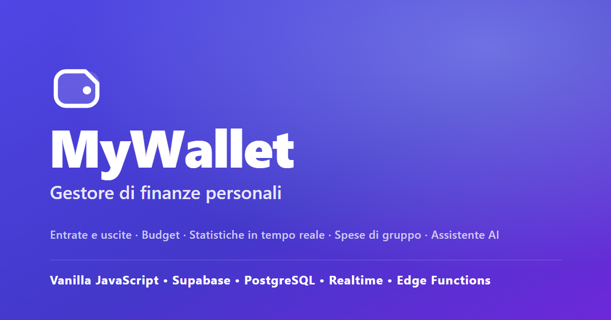
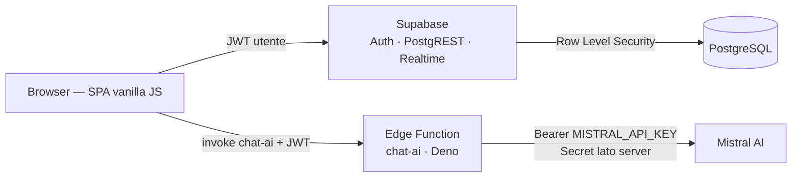

<h1 align="center">MyWallet</h1>

<p align="center">
  Gestore di finanze personali — web app senza framework, con backend Supabase.
</p>

<p align="center">
  <a href="https://chiarafioref.github.io/MyWallet/"><b>Demo live</b></a>
  &nbsp;·&nbsp;
  <a href="#funzionalità">Funzionalità</a>
  &nbsp;·&nbsp;
  <a href="#stack-tecnologico">Stack</a>
  &nbsp;·&nbsp;
  <a href="#architettura">Architettura</a>
  &nbsp;·&nbsp;
  <a href="#avvio-in-locale">Avvio in locale</a>
</p>

<p align="center">
  
  
  
  
  
</p>

<p align="center">
  
</p>

---

## Descrizione

**MyWallet** è una web application per la gestione delle finanze personali. Permette di
registrare entrate e uscite, impostare budget mensili per categoria, monitorare il saldo
in tempo reale, dividere le spese di gruppo (viaggi) e ricevere consigli da un assistente
finanziario basato su AI.

È costruita **solo con HTML, CSS e JavaScript vanilla** (nessun framework, nessuno step di
build) e usa **Supabase** come backend: autenticazione, database PostgreSQL con Row Level
Security, aggiornamenti realtime ed Edge Functions.

## Anteprima

<!--
  ISTRUZIONI (poi cancella questo commento): aggiungi le immagini in
  docs/screenshots/ seguendo docs/screenshots/HOW-TO.md, quindi togli i commenti
  qui sotto. Il README è già pronto: serve solo incollare i file.

<p align="center">
  
</p>

## Screenshot

| Dashboard | Statistiche |
| :---: | :---: |
|  |  |

| Assistente AI | Consulente di budget (50/30/20) |
| :---: | :---: |
|  |  |

| Spese di gruppo (viaggi) | Report mensile (export PDF) |
| :---: | :---: |
|  |  |
-->

> **Screenshot in preparazione.** Nel frattempo: **[apri la demo live](https://chiarafioref.github.io/MyWallet/)**.

## Funzionalità

**Portafoglio**
- Entrate, uscite e trasferimenti tra metodi di pagamento (contanti / carta)
- Saldo complessivo e disponibilità per singolo metodo, aggiornati in tempo reale
- Categorie predefinite + categorie personalizzate
- Transazioni ricorrenti e abbonamenti generati automaticamente
- Ricerca e filtri per titolo, categoria, importo, intervallo di date, metodo

**Budget e obiettivi**
- Budget mensile per categoria, con avvisi al superamento e proiezione degli abbonamenti
- Consulente di budget guidato (regola 50/30/20) che parte dalle spese reali
- Sezione **Risparmi**: obiettivi con o senza traguardo
- Sezione **Spese future**: accantonamento a quote per spese importanti

**Analisi**
- Dashboard con statistiche del mese e confronto con il mese precedente
- Grafici SVG (nessuna libreria): distribuzione per categoria, andamento 6 mesi, ritmo di spesa
- Report mensile stile estratto conto, esportabile in PDF

**In viaggio (spese di gruppo)**
- Portafogli condivisi con adesione tramite chiave
- Registrazione di chi ha pagato cosa e calcolo automatico dei rimborsi ("chi deve dare a chi")

**Assistente finanziario**
- Domande in linguaggio naturale ("Quanto ho speso per i ristoranti questo mese?")
- Verifica di sostenibilità di una spesa o di una rata
- Funziona **online** (modello Mistral) e **offline** (interprete locale integrato)

**Sicurezza e dati**
- Ogni utente vede solo i propri dati (Row Level Security su tutte le tabelle)
- La API key dell'AI non è mai nel browser: la chiamata passa da una Edge Function
- Un trigger sul database impedisce trasferimenti superiori al saldo disponibile

## Stack tecnologico

| Livello | Tecnologia | Note |
| --- | --- | --- |
| Frontend | HTML5, CSS3, **JavaScript (ES Modules)** | nessun framework, nessun bundler |
| Grafici | SVG generati a mano | nessuna libreria di charting |
| Auth | Supabase Auth | email + password, sessione con refresh token |
| Database | Supabase **PostgreSQL** | 14 tabelle, **RLS** ovunque, funzioni `SECURITY DEFINER`, trigger |
| Realtime | Supabase Realtime | `postgres_changes` filtrati per utente |
| Serverless | Supabase **Edge Functions** (Deno) | proxy autenticato verso l'API di Mistral |
| AI | Mistral AI | con fallback locale se non disponibile |
| Hosting | GitHub Pages | sito statico, nessuna pipeline di build |

## Architettura



- **SPA senza build**: `index.html` carica `assets/js/app.js` come ES Module; il routing è
  basato su `location.hash` (compatibile con GitHub Pages).
- **Un solo punto di accesso ai dati**: `data.js` incapsula tutte le query; la sicurezza è
  garantita dalle policy RLS, non dal client.
- **Chiave AI protetta**: il browser non conosce la API key di Mistral. Chiama la Edge
  Function `chat-ai` (con `verify_jwt`), che aggiunge la chiave (Supabase Secret) e inoltra
  la richiesta. Se la funzione non è raggiungibile, l'assistente ripiega sull'interprete
  locale e l'app continua a funzionare.
- **Integrità dei saldi**: oltre al controllo lato client, un trigger PL/pgSQL
  (`check_transfer_balance`) rifiuta i trasferimenti che superano la disponibilità reale del
  metodo di pagamento.

## Avvio in locale

Servono un progetto Supabase e un server statico locale (l'app usa ES Modules, non si apre
con `file://`).

```bash
# 1. clona
git clone https://github.com/chiarafioref/MyWallet.git
cd MyWallet

# 2. database: incolla ed esegui DB.sql nel SQL Editor di Supabase

# 3. config: valori del tuo progetto in assets/js/config.js
#    (SUPABASE_URL, SUPABASE_ANON_KEY sono pubblici per design)

# 4. avvia
npx serve .
```

Setup completo (Edge Function, Secret, deploy) in **[SETUP.md](SETUP.md)**.

## Documentazione per singola sezione

- [Dashboard](docs/DASHBOARD.md)
- [Gestione transazioni](docs/GESTIONETRANSAZIONI.md)
- [Transazioni ricorrenti](docs/TRANSAZIONIRICORRENTI.md)
- [Gestione statistiche](docs/GESTIONESTATISTICHE.md)
- [Sezione "In viaggio"](docs/SEZIONEINVIAGGIO.md)
- [Sezione "Risparmi"](docs/SEZIONERISPARMI.md)
- [Gestione budget](docs/GESTIONEBUDGET.md)
- [Spese future](docs/SPESEFUTURE.md)
- [Impostazioni](docs/IMPOSTAZIONI.md)
- [Assistente finanziario](docs/RICERCAINTELLIGENTE.md)
- [Trasferimento di denaro](docs/TRASFERIMENTODIDENARO.md)
- [Disponibilità](docs/SEZIONEDISPONIBILITA.md)
- [Design system](docs/DESIGN.md)

## Autore

**Chiara** — [github.com/chiarafioref](https://github.com/chiarafioref)
